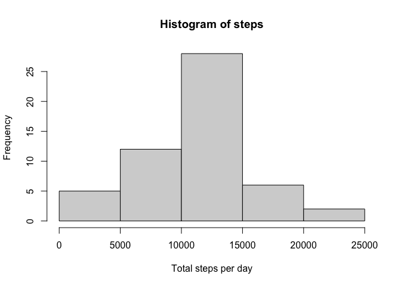
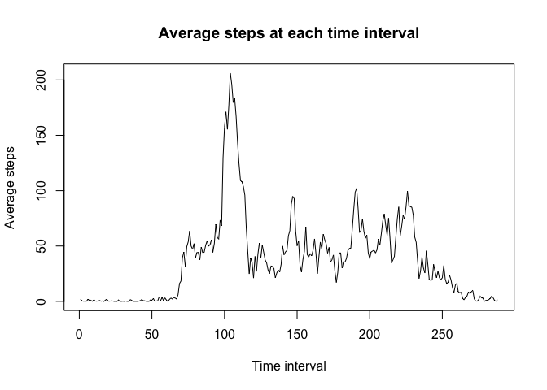
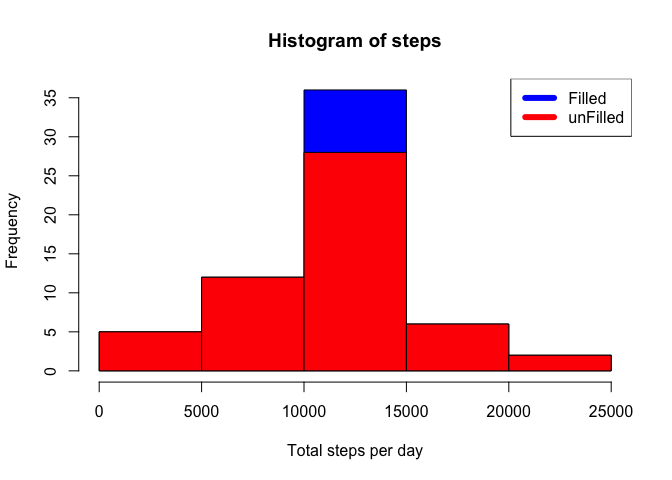
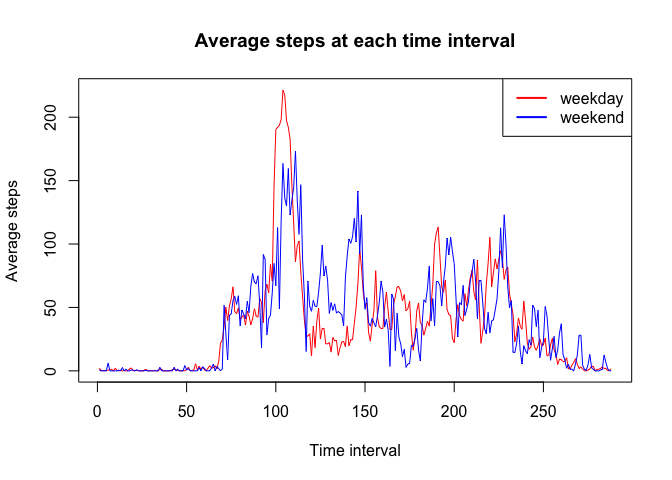

## Loading and preprocessing the data

```r
unzip("activity.zip")
activity <- read.csv("activity.csv")
summary(activity)
```

```
##      steps            date              interval     
##  Min.   :  0.00   Length:17568       Min.   :   0.0  
##  1st Qu.:  0.00   Class :character   1st Qu.: 588.8  
##  Median :  0.00   Mode  :character   Median :1177.5  
##  Mean   : 37.38                      Mean   :1177.5  
##  3rd Qu.: 12.00                      3rd Qu.:1766.2  
##  Max.   :806.00                      Max.   :2355.0  
##  NA's   :2304
```


## What is mean total number of steps taken per day?

```r
# Calculate the total number of steps taken per day
total_steps <- aggregate(activity$steps, by=list(as.factor(activity$date)), 
                         sum,na.rm=FALSE)
names(total_steps) <- c('date', 'stepsPerDay')
# Make a histogram of the total number of steps taken each day
with(total_steps, hist(stepsPerDay[!is.na(stepsPerDay)], 
                       xlab="Total steps per day", main="Histogram of steps"))
```

<!-- -->

```r
# Calculate and report the mean and median of the total number of steps taken per day
mean(total_steps$stepsPerDay,na.rm=TRUE)
```

```
## [1] 10766.19
```

```r
median(total_steps$stepsPerDay,na.rm=TRUE)
```

```
## [1] 10765
```

## What is the average daily activity pattern?

```r
# Make a time series plot of the 5-minute interval (x-axis) and the average 
# number of steps taken, averaged across all days (y-axis)
step_per_interval <- tapply(activity$steps, list(activity$interval), mean, 
                            na.rm=TRUE)
plot(step_per_interval,type="l", xlab="Time interval", ylab="Average steps",
     main="Average steps at each time interval")
```

<!-- -->

```r
# Which 5-minute interval, on average across all the days in the dataset, 
# contains the maximum number of steps?
maximum_interval <- names(step_per_interval[which.max(step_per_interval)][1])
maximum_interval
```

```
## [1] "835"
```

The 835 interval has the maximum average steps.
## Imputing missing values

```r
# Calculate and report the total number of missing values in the dataset 
total_missing <- sum(is.na(activity))
total_missing
```

```
## [1] 2304
```

```r
# Use mean for that time interval across days for computing missing values
# Create a new dataset that is equal to the original dataset but with the 
# missing data filled in.
fill_missed <- data.frame(activity)
for(i in seq(nrow(fill_missed))){
    if(is.na(fill_missed[i,"steps"])){
        current_interval <- activity[i,"interval"]
        fill_missed[i,"steps"] <- mean(subset(activity,
                                              interval==current_interval)$step,
                                       na.rm=TRUE)
    }
}
head(fill_missed)
```

```
##       steps       date interval
## 1 1.7169811 2012-10-01        0
## 2 0.3396226 2012-10-01        5
## 3 0.1320755 2012-10-01       10
## 4 0.1509434 2012-10-01       15
## 5 0.0754717 2012-10-01       20
## 6 2.0943396 2012-10-01       25
```

```r
sum(is.na(fill_missed))
```

```
## [1] 0
```

```r
# Make a histogram of the total number of steps taken each day. 
total_steps_new <- aggregate(fill_missed$steps, 
                             by=list(as.factor(fill_missed$date)), 
                         sum,na.rm=FALSE)
names(total_steps_new) <- c('date', 'stepsPerDay')
with(total_steps_new, hist(stepsPerDay[!is.na(stepsPerDay)], 
                       xlab="Total steps per day", main="Histogram of steps",
                       col="blue"))
with(total_steps, hist(stepsPerDay[!is.na(stepsPerDay)],add=TRUE,col="red"))
legend("topright",c("Filled", "unFilled"),col=c("blue","red"),lwd=6)
```

<!-- -->

```r
# Calculate and report the mean and median total number of steps taken per day
mean_filled <- mean(total_steps_new$steps)
mean_filled
```

```
## [1] 10766.19
```

```r
median_filled <- median(total_steps_new$steps)
median_filled
```

```
## [1] 10766.19
```

```r
# Camparison
mean_diff <- mean_filled - mean(total_steps$steps,na.rm=TRUE)
median_diff <- median_filled - median(total_steps$steps,na.rm=TRUE)
mean_diff
```

```
## [1] 0
```

```r
median_diff
```

```
## [1] 1.188679
```

The difference between the mean is 0 and the difference between
the median is 1.1886792. Imputing missing data increases frequency of 
total daily number between 10000 and 15000 steps.

## Are there differences in activity patterns between weekdays and weekends?

```r
activity$dayType <- as.POSIXlt(activity$date)$wday
activity_weekday <- subset(activity, !(dayType %in% c(0,1)))
activity_weekend <- subset(activity, dayType %in% c(0,1))
step_per_weekday <- tapply(activity_weekday$steps, 
                           list(activity_weekday$interval), mean, 
                            na.rm=TRUE)
step_per_weekend <- tapply(activity_weekend$steps, 
                           list(activity_weekend$interval), mean, 
                            na.rm=TRUE)
plot(step_per_weekday,type="l", xlab="Time interval", ylab="Average steps",
     main="Average steps at each time interval",col="red")
lines(step_per_weekend,col="blue")
legend("topright",c("weekday","weekend"),col=c("red","blue"),lwd=2)
```

<!-- -->

There is a higher peak at the earlier time of weekday, and the steps of the 
weekends are more spread-out.
